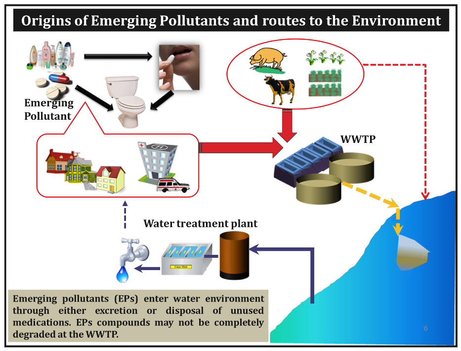

```{r, include= FALSE} 
#Para poder reproducir el siguiente código y resultados, se requiere de los siguientes paquetes:
library(prettydoc)
library(dagitty)
library(wesanderson)
library(ggdag)
```


## Hongos en plantas de tratamiento de agua residual degradando compuestos de origen farmacológico

### Antecedentes 

Los compuestos de origen farmacológico son ampliamente consumidos alrededor del mundo. Después de su función en el cuerpo humano o animal estos compuestos son excretados, llegando a las plantas de tratamiento de aguas residuales (PTAR) [@Podolsky2018; @Silva2015]. A pesar de la utilidad fundamental de las PTAR, de limpiar y purificar el agua, los compuestos farmacológicos son detectados en aguas superficiales, subterráneas e incluso agua potable (hasta unidades de µg/L) [@Verlicchi2012; @Rosal2010]. 

<center>  </center>
Figura 1. Flujo de los compuestos de origen farmacológico desde su consumo hasta los cuerpos de agua importantes, pasando por las plantas de tratamiento de aguas residuales (en inglés WWTP). [Recuperado de @Gogoi2018]. 

Sin un conocimiento preciso de como la exposición crónica y acumulativa de estos compuestos puede afectar a la vida silvestre acuática y la salud humana, se han buscado diferentes estrategias novedosas para hacer del proceso más eficiente. Precisamente, una estrategia que tenga como blanco los compuestos recalcitrantes, que realmente no logran ser degradados por los tratamientos convencionales [@Marco-Urrea2010]. Es aquí donde entran los mejores descomponedores del mundo, ¡los hongos! 

Una familia cosmopolita de hongos, los White Rot Fungi (WRF), son aquellos que encontramos en los arboles caídos, que también pueden estar presentes en las PTAR, y promover la degradación de los compuestos fármacos. Esta familia particular de hongos presentan maquinarias enzimáticas oxidativas poco específicas, que promueven la degradación de una amplia gama de compuestos fármacos [@Rodriguez-Rodriguez2013], lo cual los hace una excelente herramienta para la purificación del agua de estos compuestos. Además de la capacidad de degradación, es importante contemplar la toxicidad que puedan tener los compuestos después de la degradación. Esto debidoa que el objetivo principal es identicar los hongos que presentan una mayor degradación con una menor toxicidad asociada. Para resultar en una reducción de la concentración de estos compuestos y a su vez, una reducción en la toxicidad que puedan desembocar los compuestos. 

Para esto se plantean dos preguntas de investigación específicas, en relación a la degradación y a la toxicidad asociada. 

### Preguntas de Investigación:

**1- ¿Cómo afecta la especie del hongo en la degradación de los compuestos fármacos recalcitrantes?**


**2- ¿Cómo afecta la especie del hongo en la toxicidad después de la degradación de los compuestos fármacos recalcitrantes?**

Estas dos preguntas son esenciales, ya que conociendo cómo es el efecto de la identidad del hongo sobre la degradación y sobre la toxicidad, se puede guiar a una implementación de los hongos específicos en las PTAR, aquellos que presenten una degradación importante y una menor toxicidad ambiental (UT). 

### Variables Relevantes

En este caso, se genera un diseño experimental donde tenemos hongos aislados en cultivos individuales, los cuales serán sujetos a una exposición de compuestos fármacos. Para analizar la degradación de los compuestos, se cuantificará la concentración de los fármacos en diferentes tiempos en días (D), después de 1 día, 7 días y 21 días. Todo por triplicado.   

Buscando representar la realidad de las aguas efluentes de las PTAR, donde no tenemos  solamente un tipo de fármaco, sino una mezcla compleja de los mismos. Para esto se realiza 4 diferentes tratamientos de "cócteles de fármacos", con los dos compuestos mas frecuentes y a altas concentraciones, Ibuprofeno y Acetaminophen [@Biel-Maeso2018]. La variable de la composición de los cócteles se representa por una C, y tiene los siguientes tratamientos, las concentraciones se definen arbitrariamente:

•	Concentración de Ibuprofeno Alta,Concentración de Ibuprofeno Baja 

•	Concentración de Ibuprofeno Alta,Concentración de Ibuprofeno Alta 

•	Concentración de Ibuprofeno Baja,Concentración de Ibuprofeno Alta 

•	Concentración de Ibuprofeno Baja,Concentración de Ibuprofeno Baja 

Los diferentes cultivos de hongos aislados de las PTAR serán expuestos a los diferentes cócteles. Para esto, la identidad del cultivo, representado por una H,  será otra de las variables fundamentales. Se utilizarán cuatro especies de hongos distintas y un tratamiento adicional, de la mezcla de todos los hongos, resultando en 5 tratamientos distintos.

•	Especie1

•	Especie2

•	Especie3

•	Especie4

•	TodasEspecies

Como se mencionaba al inicio, después del tiempo determinado se cuantifica la concentración de los dos compuestos resultantes. Para esto se tiene una variable E, que representa la concentración final de Ibuprofeno, y otra variable J, que representa la concentración final de Acetaminophen. Por último, se plantea utilizar el ensayo de *Daphnia magna* para medir la toxicidad de los compuestos resultantes, obteniendo la variable UT, que representa las unidades de toxicidad [@Rodriguez-Rodriguez2011]. Estas tres variables anteriores, son continuas. 

Obteniendo de esta forma 6 variables importantes:

-Composición del cóctel de fármacos **(C)**

-Identidad del cultivo **(H)**

-Tiempo en días**(D)**

-Concentración final de Ibuprofeno **(E)**

-Concentración final de Acetaminophen **(J)**

-Unidades de toxicidad **(UT)**

### Relación entre las variables

Entre estas 6 variables existen varias relaciones importantes, empezando primero por la variable C, que corresponde a la composición del cóctel, esta variable afecta la concentración final de ambos compuestos Aceto e Ibu, ya que la concentración alta o baja de los fármacos, va a influir la concentración final después de la degradación. Una Cn mas alta de alguno de los compuestos va a ser mas díficil de degradar, si se considera el punto bioquímico de saturación enzimática. Y también la composición del cóctel afecta la toxicidad (UT) resultante, ya que algunos tratamientos por sí solos pueden ser mas tóxicos que otros, sin contar todavía la degradación de los hongos. Esto ya que, la toxicidad de un compuesto depende de su vía de acción y formula química. Seguidamente, la variable H, que representa la identidad de los cultivos de hongos, va a afectar directamente las concentraciones finales de Ibu (E) y Aceto (J), ya que existen algunos hongos que logran degradar más unos compuestos sobre otros, por sus capacidad enzimáticas específicas. A su vez, esta variable también afecta la toxicidad (UT), ya que algunos hongos pueden producir intermediarios tóxicos que afecten el valor de UT, sin degradar los compuestos. 

En cuanto a la variable de tiempo en días (D), esta afecta a las concentraciones finales de los compuestos, ya que se espera que a mayor tiempo, mayor sea la degradación de los compuetsos, resultando en una menor concentración. Por último, las dos variables de concentraciones finales de Ibu (E) y Aceto (J) afectan directamente la toxicidad (UT), ya que los compuestos resultantes pueden tener toxicidades distintas e importantes de evidenciar. Para representar estas relaciones entre las variables, se realiza el siguiente diagrama causal:

```{r, echo = FALSE}
dag <- dagify(E ~ C, J ~ C,  E ~ H, J ~ H, E ~ D, J ~ D,
              UT ~ E, UT ~ J,
               UT ~ C, UT ~ H)

ggdag(dag, layout = "circle") + theme_dag()
```

### Datos 

Para responder a las preguntas con el diseño experimental planteado, se simulan los datos tomando en cuenta las relaciones anteriormente descritas y conocimiento de antemano el comportamiento de las variables continuas. 

Se presenta el código de simulación: 

```{r, collapse = TRUE}
#SIMULACIÓN DE DATOS

#Generación de los vectores para varibles independientes
C <- rep(c("IbuA_AcetoB", "IbuA_AcetoA", "IbuB_AcetoA", "IbuB_AcetoB"), each= 45) #Composición del cóctel
H <- rep (rep(c("Especie1", "Especie2", "Especie3", "Especie4", "TodasEspecies"), each= 9), 4) #Identidad del cultivo de Hongo
length(C) 
length(H) 

D <- rep( rep( rep(c("dias1", "dias7", "dias21"), 3), 5 ), 4 ) #Tiempo en días
length(D) 

R <- rep(c("Replica1", "Replica2", "Replica3"), 60) #3 replicas, ya que se hace por triplicado
length(R) 

#Determinación del tamaño del efecto entre variables
#Importante: Los efectos son promedios de distribución normal*

#Tamaño del efecto de las concentraciones de Ibuprofeno (inicial (C) - final(E))
E.IbuA <- -1.3
E.IbuB <- -2
E.Ibu <- c(E.IbuA, E.IbuA, E.IbuB, E.IbuB) 

#Tamaño del efecto de las concentraciones de Acetaminophen (inicial (C) - final(J))
J.AcetoA <- -1
J.AcetoB <- -1.7
J.Aceto <- c(J.AcetoB, J.AcetoA, J.AcetoA, J.AcetoB) 

#Tamaño de efecto de concentraciones iniciales (A) sobre ecotoxicidad (UT)
UT.IbuA <- 1
UT.IbuB <- 0.5

UT.AcetoA <- 1.5
UT.AcetoB <- 1

UT.farmacos <- c(UT.IbuA + UT.AcetoB, UT.IbuA + UT.AcetoA, UT.IbuB + UT.AcetoA, UT.IbuB + UT.AcetoB )

#Tamaño de efecto de los cultivos (B) sobre ecotoxicidad (UT)
UT.Especie1 <- 2
UT.Especie2 <- 0.3
UT.Especie3 <- 0.2
UT.Especie4 <- 0.01
UT.TodasEspecie <- 0.6

UT.Cultivo <- c(UT.Especie1, UT.Especie2, UT.Especie3, UT.Especie4, UT.TodasEspecie)

#Tamaño de efecto de los cultivos (C) sobre concentración final Ibuprofeno (E)
E.Especie1 <- -0.6
E.Especie2 <- -1.2
E.Especie3 <- -0.7
E.Especie4 <- -0.9
E.TodasEspecie <- -1.8

E.Cultivo <- c(E.Especie1, E.Especie2, E.Especie3, E.Especie4, E.TodasEspecie)

#Tamaño de efecto de los cultivos (C) sobre concentracion final de Acetaminophen (j)
J.Especie1 <- -0.6
J.Especie2 <- -0.9
J.Especie3 <- -1.1
J.Especie4 <- -1.2
J.TodasEspecie <- -1.7

J.Cultivo <- c(J.Especie1, J.Especie2, J.Especie3, J.Especie4, J.TodasEspecie)

#Tamaño de efecto de los tiempos (D) sobre concentración final Ibuprofeno (E)
E.dias1<- -0.5
E.dias7<- -1
E.dias21 <- -1.9

E.dias <- c(E.dias1, E.dias7, E.dias21)

#Tamaño de efecto de los tiempos (C) sobre concentración final Acetaminophen (J)
J.dias1<- -0.4
J.dias7<- -0.9
J.dias21 <- -1.7

J.dias <- c(J.dias1, J.dias7, J.dias21)

#Tamaño de efecto de la concentración final Ibuprofeno (E) sobre ecotoxicidad (UT)
UT.E <- 1.3

#Tamaño de efecto de las concentración final Acetaminophen (J) sobre ecotoxicidad (UT)
UT.J <- 1.6

#Determinación del error, que va a ser asignado a todo por igual
Error <- 0.2

#Determinación de réplicas
Replicas<- seq(1:3)

#Simulación de variables continuas

#Variable de concentración final de Ibuprofeno (E)
E <- c()
l <- 1
for (w in 1:length(E.Ibu)) {
  for (h in 1:length(E.Cultivo)) {
      for (i in 1:length(Replicas)) {
        for (j in 1:length(E.dias)) {
        E[l] <-
          10 + rnorm(n = 1,
                     mean = E.Ibu[w],
                     sd = Error) + rnorm(n = 1,
                                         mean = E.Cultivo[h],
                                         sd = Error) +
          rnorm(n = 1,
                mean = E.dias[j],
                sd = Error)
        l <- l + 1
      }
    }
  }
}

#Variable de concentración final de Acetaminophen (J)
J <- c()
l <- 1
for (w in 1:length(J.Aceto)) {
  for (h in 1:length(J.Cultivo)) {
      for (i in 1:length(Replicas)) {
        for (j in 1:length(J.dias)) {
        J[l] <-
          10 + rnorm(n = 1,
                     mean = J.Aceto[w],
                     sd = Error) + rnorm(n = 1,
                                         mean = J.Cultivo[h],
                                         sd = Error) +
          rnorm(n = 1,
                mean = J.dias[j],
                sd = Error)
        l <- l + 1
      }
    }
  }
}


#Variable de ecotoxicidad por unidad de toxicidad (UT)
UT<- c()
l <- 1
for (w in 1:length(UT.farmacos)) {
  for (h in 1:length(UT.Cultivo)) {
    for (j in 1:length(J.dias)) {
      for (i in 1:length(Replicas)) {
        UT[l] <-
          10 + rnorm(n = 1,
                     mean = UT.farmacos[w],
                     sd = Error) + rnorm(n = 1,
                                         mean = UT.Cultivo[h],
                                         sd = Error) +
         E[l]* rnorm(n = 1,
                mean = UT.E,
                sd = Error) +
          J[l]* rnorm(n = 1,
                      mean = UT.J,
                      sd = Error)
        l <- l + 1
      }
    }
  }
}

Dat <- data.frame(Composicioncoctel=C, Composicioncultivo=H, Dias=D, R=R, E=E, J=J, Toxicidad=UT)
#write.csv(Dat,"/Users/johanaakerman/Desktop/ProyectoFinal/Data//Data.csv", row.names = FALSE) Para crear el archivo .csv. El path es definido especificamente. 
#Dat <- read.csv("Data.csv", sep = ",", header = TRUE) Se puede abrir la base con este comando si se desea no correr la simulación.
```

### Análisis Estadístico

Los datos están organizados de la siguiente manera:
```{r}
head(Dat)
```

Para comenzar se realiza una análisis exploratorio del comportamiento de las variables, para ver las diferentes tendencias simuladas anteriormente. Se realizan tres histogramas de las tres variables continuas presentes.  

```{r, dpi= 150}
par(mfrow= c(2,2))
hist(Dat$E, col = cm.colors(10), main = "", xlab = "Concentración final de Ibuprofeno (ug/L)")
hist(Dat$J, col = cm.colors(10), main = "", xlab = "Concentración final de Acetaminophen (ug/L)")
hist(Dat$Toxicidad, col = cm.colors(10), main = "", xlab = "Ecotoxicidad (Unidad de Toxicidad))")
```

Se puede evidenciar, como los tres gráficos anteriores presentan ua tendencia a comportamiento normal, Gausiano.
Ahora se realizan gráficos para ver las tendencias de la relación entre dos variables de interés, empezando por las variables de la pregunta 1. 

```{r}
Dat$Composicioncultivo <- as.factor(Dat$Composicioncultivo) #Se asegura que esté la variable sea factor
plot(Dat$Composicioncultivo, Dat$E, col = cm.colors(7), xlab = "Composición de los cultivos de hongos", ylab = "Concentración final de Ibuprofeno (ug/L)")
```

Se puede notar, como existen diferencias observables entre los diferentes composiciones del cultivo de hongos para la concentración final de Ibuprofeno. Además, a simple vista podemos ver como el cultivo con todas las especies presenta una menor concentración de Ibuprofeno. 

```{r}
plot(Dat$Composicioncultivo, Dat$J, col = cm.colors(7), xlab = "Composición de los cultivos de hongos", ylab = "Concentración final de Acetaminophen (ug/L)")
```

Un comportamiento muy similar de los datos se puede encontrar también para las concentraciones finales de Acetamiphen, donde el tratamiento con menor concentración final es el cultivo con todas las especies. 

Enfocando la atención ahora a la segunda pregunta, referente a la toxicidad. 

```{r, dpi= 150}
par(mfrow= c(1,2))
plot(Dat$Toxicidad, Dat$E, col = cm.colors(5), lwd = 2, xlab = "Ecotoxicidad (Unidad de Toxicidad))", ylab = "Concentración final de Ibuprofeno (ug/L)")
plot(Dat$Toxicidad, Dat$J, col = cm.colors(7), lwd = 2,xlab = "Ecotoxicidad (Unidad de Toxicidad))", ylab = "Concentración final de Acetaminophen (ug/L)")
```

Para ambos compuestos se puede encontrar una relación directamente proporcional, donde a menor sea la concentración de los compuestos fármacos, menor es la toxicidad asociada. 

Por último de análisis exploratorio, se analiza la toxicidad resultante en relación al tiempo de degradación, que se midió al día 1, 7 y 21. 
```{r}
Dat$Dias <- as.factor(Dat$Dias) #Se asegura que esté la variable sea factor
plot(Dat$Toxicidad ~ Dat$Dias,  col = cm.colors(4),  xlab = "Tiempo en días", ylab = "Ecotoxicidad (Unidad de Toxicidad)")
```

Se evidencia en este gráfico anterior, como la toxicidad es influenciada por la duración del tiempo de degradación, en este caso los días 1, 7 y 21; donde conforme pasa el transcurso de los días se logra obtener una menor toxicidad resultante. 

#### Modelos de regresión lineal simple

Para responder a la primera pregunta (*¿Cómo afecta la especie del hongo en la degradación de los compuestos fármacos recalcitrantes?*), se realizan dos modelos de regresión lineal simple, para cada uno de los compuestos fármacos de interés, Ibuprofeno y Acetaminophen. Siendo la variable respuesta las concentraciones finales de los compuestos (E y J), y la variable predictora la composición del cultivo de hongos (H) y el tiempo en días (D). No se agregan otras variables, por razonamiento biológico y para no introducir sesgos en el modelo, apoyado por la lógica analizada en el DAG, donde las demás variables son conocidas como *colliders*, y por su naturaleza causal, no es necesario controlarlas. 

#### Regresión Lineal Simple - Cn de Ibuprofeno & Composición del Cultivo
```{r}
Modelo.Ibu <- lm(E ~ Dat$Composicioncultivo * D) #Modelo con interacción con tiempo en días, con el objetivo de ver como cambia la Cn con el efecto del tiempo
```

Antes de la interpretación de los resultados se comprueban los supuestos de la regresión lineal simple, que son linealidad de los datos, normalidad de los residuos y homocedasticidad de la varianza de los residuos. 

#### -Comprobación de Supuestos
```{r, collapse= TRUE}
#Linealidad de los datos
par(mfrow = c(2,2))
plot(Modelo.Ibu, 1) #Gráfico de residuales vs. Ajustados

#Normalidad de los residuales
plot(Modelo.Ibu, 2) #Gráfico QQplot
shapiro.test(Dat$E) #Utiliza como hipótesis nula que hay diferencias entre una distribución normal y la realizada. Por lo cual, si queremos demostar que hay normalidad, buscamos un p-value mayor a 0.05, donde no se rechaza la hipótesis nula, por lo tanto no son diferentes una distribución normal y la realizada. 

#Homocedasticidad de la varianza de los residuos
plot(Modelo.Ibu, 3) #Gráfico scale location plot, utilizado para ver si los residuales son distribuidos de manera homogénea a lo largo del rango de predictores. 
bartlett.test(Dat$E ~ Dat$Composicioncultivo) #Misma lógica del Shapiro.Test pero para homogeneidad de varianzas. Se obtiene un p-value mayor a 0.05, no se rechaza hipótesis nula.
```

Analizando las diferentes pruebas gráficas y test para comprobar los supuestos, se concluye que los datos tienen comportamiento de normalidad. Sabiendo esto, se analiza el resultado de la regresión lineal simple realizada.
```{r}
summary(Modelo.Ibu)
confint(Modelo.Ibu)
```


Con base al ouput anterior, se puede concluir que el cultivo con la Especie2 tiene un efecto significativo negativo sobre la concentración final de Ibuprofeno, de un cambio -0.66 veces cuando es el hongo que degrada es de la Especie2 (Estimado = -0.663, error std = 0.212, p-value = 0.0021), IC = [-1.081, -0.244]. También el cultivo de todas las Especies muestra un efecto significativo negativo mayor que en el cultivo de la Especie 2, teniendo un cambio sobre la concentración final de Ibuprofeno cuando son todas las especies de -1.149 veces (Estimado = -1.149, error std = 0.212, p-value = 1.99e^-07^), IC = [-1.567, -0.731]. Recordar que como es la concentración final, el valor negativo de los estimados represena una disminución, lo cual es de hecho lo que buscamos al usar los hongos. Como también es importante notar, todas las espcies degradan en cierta manera, obteniendo estimados negativos para todas las especies.  Por último, se puede evidenciar, como el día 21, que es el último día de degradación por parte de los hongos, se obtiene un efecto negativo significativo sobre la concentración de Ibuprofeno (Estimado = -1.457, error std = 0.212, p-value = 1.15e^-10^), IC = [-1.875,-1.039], demostrando como el mayor efecto del la degradación se obtiene hasta el último día. En conclusión, en este modelo la variable respuesta explica una variación de 70% de los datos, lo cual se considera alto y relevante (R^2^ = 0.6944).

#### Regresión Lineal Simple - Cn de Acetaminophen & Composición del Cultivo

Se realiza lo mismo que en el modelo anterior
```{r}
Modelo.Aceto <- lm(J ~ H * D) #Modelo con interacción con el tiempo con el objetivo de ver como cambia en el tiempo el efecto de los cultivo en la Cn de Aceto
```

#### -Comprobación de supuestos
```{r, collapse= TRUE}
#Linealidad de los datos
par(mfrow = c(2,2))
plot(Modelo.Aceto, 1) #Gráfico de residuales vs. Ajustados

#Normalidad de los residuales
plot(Modelo.Aceto, 2) #Gráfico QQplot
shapiro.test(Dat$J)

#Homocedasticidad de la varianza de los residuos
plot(Modelo.Aceto, 3) #Gráfico scale location plot
bartlett.test(Dat$J ~ Dat$Composicioncultivo)
```

Al igual que en el modelo pasado, se comprueba normalidad para el modelo de la concentración de Acetaminophen. Se procede a interpretar los resultados del modelo

```{r}
summary(Modelo.Aceto)
confint(Modelo.Aceto)
```

A diferencia de las concentraciones finales de Ibuprofeno, para el compuesto Acetaminpohen, solo la especie2 no tuvo un efecto significativo. La Especie 3 y la 4 presentaron un efecto significativo negativo muy parecido en magnitud de concentración de Acetaminophen, de un cambio -0.568 veces cuando es el hongo que degrada es de la Especie3 (Estimado = -0.542, error std = 0.196, p-value = 0.0043), IC = [-0.954, -0.181]; o la Especie4 (Estimado = -0.543, error std = 0.212, p-value = 0.0063), IC = [-0.9929, -0.156]. Nuevamente, la composición del cultivo con mayor degradación es aquel con todas las especies (Estimado = -1.187, error std = 0.196, p-value = 8.97 e^-09^ ), IC = [-1.574, -0.800], lo cual tiene sentido biológico, ya que si la mayoría de especies logran degradar el compuesto, juntos lo hacen con una mayor magnitud, de hecho de -1.187 veces menor concentración de Acetaminophen (mas del doble que cuando los cultivos son de una especie individual). Por último, al día 7 y 21, se obtiene un efecto significativo negativo sobre la concentración de Acetaminophen, con una magnitud mayor para los 21 días que los 7. Lo cual tiene sentido, ya que a mayor tiempo, mayor es la capacidad de degradación (Estimado = -1.325, error std = 0.196, p-value = 2.23 e^-10^ ), IC = [-1.712, -0.938] y (Estimado = -0.498, error std = 0.196, p-value = 0.0119), IC = [-0.885, -0.112], respectivamente. Demostrando algo muy interesante, y es que la Cn de acetaminophen tiene un cambio significativo desde el día 7, mientras que la Cn de ibuprofeno, hasta el día 21. En conclusión, en este modelo la variable respuesta explica una variación de 68% de los datos, lo cual se considera alto y relevante (R^2^ = 0.6753).


#### Regresión Lineal Simple - Toxicidad Resultante & Composición del Cultivo

Ahora se retorna a la pregunta 2 (*¿Cómo afecta la especie del hongo en la toxicidad después de la degradación de los compuestos fármacos recalcitrantes?*), para esto se realizan dos modelos de regresión lineal simple nuevamente, para cada uno de los compuestos fármacos de interés, Ibuprofeno y Acetaminophen. En este caso, teniendo como  variable respuesta la toxicidad obtenida después de la degradación fúngica (Toxicidad). En este caso, se busca el efecto indirecto causal y el efecto causal directo, de la composición del cultivo en la toxicidad, tomando en cuenta que es la toxicidad después de llevar a cabo el proceso de degradación. De esta manera, se plantea el siguiente modelo. Esto es de particular interés, ya que se busca identificar los hongos que puedan degradar más estos compuestos pero que a su vez, no representen un peligro extra en el proceso de degradación, y reduzca de esta forma la toxicidad general. 


```{r}
Modelo.Toxicidad <- lm(Dat$Toxicidad ~ Dat$Composicioncultivo) 
```

#### -Comprobación de supuestos
```{r, collapse= TRUE}
#Linealidad de los datos
par(mfrow = c(2,2))
plot(Modelo.Toxicidad, 1) #Gráfico de residuales vs. Ajustados

#Normalidad de los residuales
plot(Modelo.Toxicidad, 2) #Gráfico QQplot
shapiro.test(Dat$Toxicidad) #No se rechaza hipótesis nula, se concluye normalidad de residuos 

#Homocedasticidad de la varianza de los residuos
plot(Modelo.Toxicidad, 3) #Gráfico scale location plot
bartlett.test(Dat$Toxicidad ~ Dat$Composicioncultivo) #No se rechaza hipótesis nula, se concluye normalidad de residuos 
```

Al igual que en los dos modelos pasados, se comprueba normalidad. Se procede a interpretar los resultados del modelo

```{r}
summary(Modelo.Toxicidad)
confint(Modelo.Toxicidad)
```

Se puede notar que todas las especies y las especies juntas tienen un efecto significativo negativo sobre la toxicidad del compuesto resultante; lo que se puede interpretar como, todas las especies reducen la toxicidad en lugar de aumentarla. Todavía mas relevante, podemos ver que el cultivo con todas las especies presenta una magnitud de cambio mucho menor en comparación con las demás especies individuales (Estimado = -4.690, error std = 0.683, p-value = 1.08 e ^-10^ ), IC = [-6.036, -3.343]. Importante de notar que, este modelo explica 24% de la variación de los datos (R^2^ = 0.2415), lo cual tiene sentido ya que estamos utilizando únicamente la toxicidad, para un efecto total, que incluye los directos e indirectos. 


### Referencias

